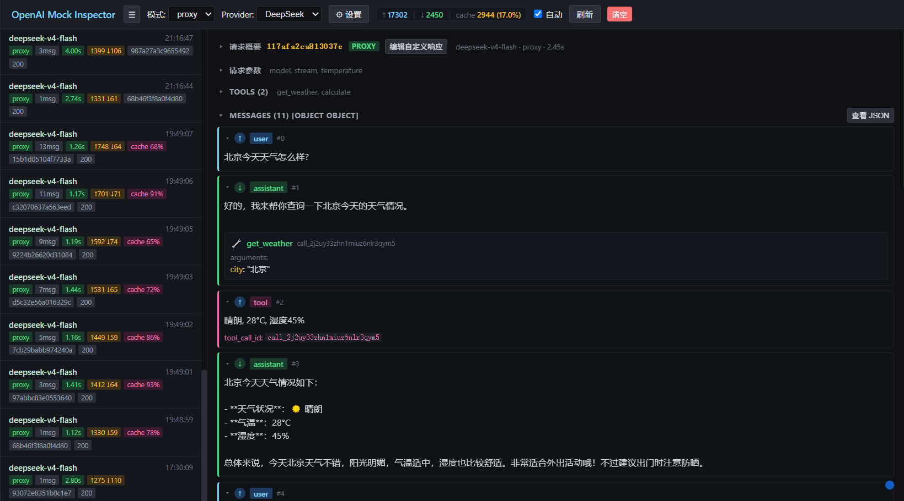

# OpenAI Mock Inspector

An observable OpenAI-compatible API mock / proxy. Single-file deployment with a built-in visual inspection console.



> 中文文档请见 [README_zh.md](README_zh.md)

## Features

- **Mock Mode**: Accepts any OpenAI-format request and returns a valid response without calling a real LLM
- **Proxy Mode**: Forwards requests to a real OpenAI-compatible endpoint (OpenAI / DeepSeek / ARK, etc.) while recording both upstream and downstream content
- **Custom Responses**: Bind a custom response to a request hash; subsequent identical conversations return the response directly
- **Visual Inspection Console**: View request/response details in the browser with switchable Human and JSON views
- **Provider Management**: Save multiple proxy targets and switch between them at any time
- **Token Statistics**: Automatically extracts input/output/cache tokens and cache hit rate
- **Log Persistence**: Request records are saved to `logs.jsonl` with configurable retention

## Quick Start

### Download from Release (Recommended)

Visit the [Releases page](../../releases) and download the executable for your platform:

| Platform | File |
|----------|------|
| Windows | `openaimock-windows-amd64.exe` |
| Linux | `openaimock-linux-amd64` |
| macOS (Intel) | `openaimock-darwin-amd64` |
| macOS (Apple Silicon) | `openaimock-darwin-arm64` |

Run directly after download — no runtime environment required.

### Build from Source

```bash
# Build the frontend
cd web && npm install && npm run build && cd ..

# Build the backend (frontend assets are embedded into the binary)
go build -o openaimock.exe .

# Run
./openaimock.exe
```

### Local Development

```bash
# Terminal 1: Start the Go backend (API + static files)
go run .

# Terminal 2: Start the frontend dev server with HMR (http://localhost:5173/admin/)
cd web && npm run dev
```

After starting:

| Entry | URL |
|-------|-----|
| OpenAI API | `http://localhost:12010/v1` |
| Visual UI (production) | `http://localhost:12010/admin/` |
| Visual UI (development) | `http://localhost:5173/admin/` |

## Usage

### 1. Mock Mode (Default)

No configuration required. Just point your client to the mock service:

```python
from openai import OpenAI
client = OpenAI(
    base_url="http://localhost:12010/v1",
    api_key="sk-anything",  # any value
)
resp = client.chat.completions.create(
    model="deepseek-v4-flash",
    messages=[{"role": "user", "content": "Hello"}],
)
```

Requests are recorded in the inspection console, and responses are generated automatically (echoing the user message; returns `tool_calls` when tools are present).

### 2. Proxy Mode (Forwarding to a Real LLM)

1. Open `http://localhost:12010/admin/`
2. Click ⚙ Settings -> Provider Management -> Add Provider
   - Name: e.g. DeepSeek
   - Base URL: e.g. `https://api.deepseek.com/v1`
   - API Key: your real key
   - Override Model: leave blank to keep original, or fill in a replacement model name
3. After saving, click "Use"
4. Switch the top mode selector to `proxy`

Subsequent requests will be forwarded to the real LLM, and the inspection console displays both the client request and the LLM response.

### 3. Custom Response (Fixed Return for a Specific Conversation)

1. Click a request in the inspection console
2. Click "Edit Custom Response"
3. Modify the JSON response in the editor
4. After saving, subsequent requests with the same hash will return this response directly

## Inspection Console

### Sections

Each request detail contains the following sections — click the title to collapse/expand:

| Section | Default State | Collapsed Summary |
|---------|---------------|-------------------|
| Request Overview | Collapsed | Model · Source · Duration |
| Request Parameters | Collapsed | Parameter name list |
| Tools | Collapsed | Tool name list |
| Messages | Expanded | - |
| Forwarded Upstream Request | Collapsed | model |
| Upstream Response | Expanded | - |
| Response Returned to Client | Expanded | Response summary |

Each section has a "View JSON" button in the top-right corner to toggle between raw JSON and Human views.

### Message Direction

Each message has a direction arrow on the left:

- **↑ Blue**: Sent to the LLM (system / user / tool)
- **↓ Green**: Returned by the LLM (assistant)

Click the message header to collapse it (the content area remains freely selectable and copyable); when collapsed, a content summary is displayed.

### Token Statistics

- **List items**: Each request shows duration (seconds when >500ms), input/output tokens, and cache hit rate
- **Header stats**: Cumulative input/output/cache tokens and overall hit rate across all requests
- **Request overview**: Expanded view shows full token breakdown and cache hit rate

### Sidebar

- Wide screens: Sidebar occupies space normally
- Narrow screens (<768px): Auto-hidden; hovers out when the mouse approaches the left edge, or toggle with the ☰ button

## Configuration Files

Generated automatically at runtime:

| File | Contents |
|------|----------|
| `state.json` | Provider configs, mode, custom responses |
| `logs.jsonl` | Request records (one JSON per line) |

The log retention count is configurable in ⚙ Settings -> General Settings (default 50 entries).

Delete both files to reset all configurations and records.

## Project Structure

```
├── main.go              # Routing + embedded frontend + SPA fallback
├── store.go             # Data model + logs.jsonl persistence
├── handlers.go          # Request handling + admin API
├── web/                 # React frontend
│   ├── src/
│   │   ├── App.tsx      # Main app
│   │   ├── components/  # Sidebar / Detail / SettingsModal / CustomEditor
│   │   ├── api.ts       # API wrappers
│   │   ├── types.ts     # Type definitions
│   │   └── utils.ts     # Utility functions
│   ├── vite.config.ts   # base: /admin/ + dev proxy
│   └── package.json
├── .github/workflows/
│   ├── release-please.yml  # Auto changelog + tag
│   └── build.yml           # Multi-platform build + Release upload
└── go.mod
```

The React build output is embedded into the binary via `//go:embed`, producing a single file after compilation.

## Development Workflow (Conventional Commits + Auto Release)

The project uses [release-please](https://github.com/googleapis/release-please) to manage versions and changelog automatically.

### Commit Format

```
<type>: <description>

feat:     New feature (triggers minor version bump)
fix:      Bug fix (triggers patch version bump)
perf:     Performance improvement
refactor: Code refactoring
ci:       CI/CD changes
docs:     Documentation
chore:    Miscellaneous
```

### Release Flow

```
1. Create a branch from main for development
   git checkout main && git pull
   git checkout -b feat/some-feature

2. Commit with conventional commits
   git commit -m "feat: add some feature"

3. Create a PR to merge into main

4. release-please automatically creates a "Release PR" (with changelog)
   - Multiple feat/fix commits accumulate in the same Release PR
   - You can wait until all development is done before merging

5. Merge the Release PR -> auto-create tag -> build.yml auto-builds and publishes
```

No manual `git tag` or `git push origin v*` required.

### CI/CD Notes

| Workflow | Responsibility | Trigger |
|----------|----------------|---------|
| `release-please.yml` | Analyzes commits, updates CHANGELOG.md, creates Release PR; after merge, creates tag + Release and auto-builds multi-platform binaries for upload | Push to main |

Build platforms:

| Platform | Runner |
|----------|--------|
| Windows amd64 | `windows-latest` |
| Linux amd64 | `ubuntu-latest` |
| macOS Intel | `macos-15-intel` |
| macOS Apple Silicon | `macos-latest` |

> **Note**: Before use, enable `Allow GitHub Actions to create and approve pull requests` in the GitHub repository's Settings -> Actions -> General -> Workflow permissions.
